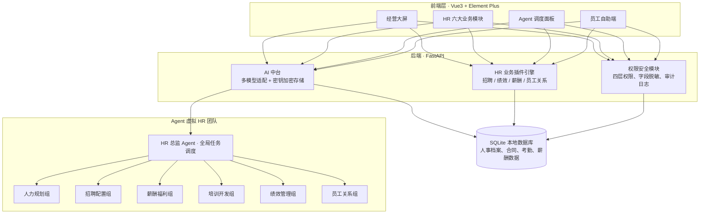

<div align="center">

# 源智 HR

### 基于多 Agent 的开源智能人力运营操作系统

[](LICENSE)
[](https://vuejs.org/)
[](https://fastapi.tiangolo.com/)
[](https://www.python.org/)

</div>

> 传统 HR 系统：人操作软件，手动录入、手动处理单据。
>
> 源智 HR：**软件搭载虚拟 HR 团队，AI Agent 自动承接人事事务，人工仅做审核与决策。**
>
> 所有大模型 API 密钥由用户自行保管，数据保存在本地服务器，不上传第三方云端。

---

## ✨ 核心亮点

- 🤖 **多 Agent 虚拟 HR 部门**：HR 总监调度 Agent + 6 大 HR 专业小组 + 21 个执行 Agent，自动拆解、流转人事任务
- 🔒 **完全私有化部署**：本地数据库存储人事敏感数据，API Key 本地加密存储，无厂商侧数据中转
- 🔌 **全模型兼容**：OpenAI 兼容协议，支持豆包、DeepSeek、通义千问、智谱、Kimi、GPT 等，粘贴密钥自动识别模型
- 🧩 **微内核插件架构**：核心底座稳定，招聘、绩效、薪酬等业务能力以插件形式加载，支持自定义扩展
- 🛡️ **企业级四层权限**：菜单权限、行级数据隔离、字段脱敏、Agent 调用权限，薪资等敏感信息可做双盲管控
- 📊 **多角色可视化大屏**：老板人力经营看板、HR 业务大屏、部门管理视图、员工自助工作台



---

## 🎯 适合谁 & 解决什么痛点

**目标用户**：中小制造企业、科技创业公司、需要人事数据私有化的组织。

传统人事系统普遍痛点：

- HR 大量时间消耗在简历筛选、合同整理、绩效汇总、制度解读等重复事务
- 系统只是表单审批工具，不会主动发现人力风险（离职预警、人力成本异常）
- 人事敏感数据存放在 SaaS 厂商云端，企业有数据泄露顾虑
- 权限粗糙，薪资、身份证等敏感信息很难精细化隔离
- 功能固化，很难根据企业管理制度自定义扩展

**源智 HR 工作流示例**：

> 招聘简历入库 → 招聘 Agent 自动筛选简历、生成面试邀约 → 面试结束自动汇总面试记录 → 入职后自动建立员工档案 → 绩效周期自动下发考核、汇总评分 → 薪酬 Agent 核算薪资社保个税 → 员工关系 Agent 监控合同到期、识别离职风险。

AI 生成结果全部提交人工复核，不会直接落地生效。

---

## 🧩 核心能力

### 1. 六大 HR 业务模块

- **组织架构管理**：部门树、岗位编制、人员编制对比
- **员工档案**：人事档案、劳动合同、证件、紧急联系人
- **考勤与假期**：打卡记录、请假流程、加班统计
- **薪酬福利**：薪资核算、社保公积金、个税自动计算
- **招聘配置**：简历库、招聘漏斗、面试排期、渠道统计
- **员工关系**：入转调离、合同到期预警、奖惩、离职管理
- **绩效管理**：KPI 指标管理、考核周期、绩效分布分析
- **培训开发**：课程库、培训计划、人才梯队管理

### 2. 多 Agent 虚拟 HR 团队

- **HR 总监 Agent**：接收任务，拆解子任务，分配给各 HR 小组，汇总结果并推送待办给人工审核
- **人力规划组 Agent**：编制分析、人力成本预测、组织健康度评估
- **招聘配置组 Agent**：简历初筛、面试邀约、面试纪要生成、候选人标签
- **薪酬福利组 Agent**：薪资试算、社保个税校验、薪酬报表生成
- **培训开发组 Agent**：培训需求收集、培训计划生成、培训效果复盘
- **绩效管理组 Agent**：考核下发、绩效汇总、绩效异常识别
- **员工关系组 Agent**：合同到期提醒、离职风险识别、劳动法合规校验

> **内控规则**：Agent 仅输出方案与提案，关键业务变更必须人工审批后写入系统。

### 3. AI 中台与合规引擎

- 用户自托管 API Key，Fernet 加密存储，密钥不会上传外部服务器
- 内置劳动法、社保、个税、休假合规规则库，AI 输出自动校验，降低幻觉风险
- **组织记忆**：持续学习企业内部管理习惯，沉淀组织人力知识，越使用越贴合企业实际

### 4. 数据可视化与安全审计

- 多角色大屏：老板人力经营看板、HR 业务看板、部门管理者视图，指标支持逐层下钻溯源
- 四层权限模型：菜单权限 / 行级数据权限 / 字段脱敏 / Agent 调用权限
- 完整操作审计日志，记录人员、时间、操作内容，满足内部审计需求
- 数据库备份、数据恢复能力

---

## ⚖️ 差异化对比

| 维度 | 传统 SaaS 人事 | 通用大模型对话 | 源智 HR |
|---|---|---|---|
| 部署方式 | 数据托管厂商云端 | 数据上传模型厂商 | 本地私有化部署 |
| AI 能力 | 单点问答 | 通用对话，无 HR 数据底座 | 多 Agent 团队协同，全链路自动处理 |
| 业务打通 | 表单审批 | 无组织人事档案 | 招聘-绩效-薪酬-离职全链路闭环 |
| 合规能力 | 弱 | 无 | 内置劳动法/社保/个税规则库 |
| 扩展能力 | 功能固定 | 无业务扩展 | 微内核插件化，自定义业务模块 |
| 权限粒度 | 菜单级 | 无 | 菜单/行/字段/Agent 四层权限 |

---

## 🧱 技术栈

| 层级 | 技术 | 说明 |
|---|---|---|
| 前端 | Vue3 + Vite + Element Plus + Pinia | 管理后台、可视化大屏、员工自助端 |
| 后端 | FastAPI + Python 3.11 + SQLAlchemy | 异步高性能后端服务 |
| 数据库 | SQLite | 开箱即用本地数据库，无需单独部署 |
| AI 层 | OpenAI 兼容协议 + Fernet 加密 | 多模型统一接入，API 密钥本地加密存储 |

---

## 🚀 快速上手

**环境前置**：Python 3.11+、Node.js 18+

```bash
# 1. 克隆仓库
git clone https://github.com/a2-DEL/yuanzhi-hr.git
cd yuanzhi-hr

# 2. 启动后端
cd backend
pip install -r requirements.txt
python run.py
# 后端服务：http://127.0.0.1:8001

# 3. 启动前端
cd ../frontend
npm install
npm run dev
# 前端访问：http://127.0.0.1:5174
```

**默认账号**

- 账号：`admin`
- 密码：`admin123`

**配置 AI 模型**

进入系统菜单「AI 能力 → 模型配置」，粘贴你的大模型 API Key，系统自动识别模型厂商，点击测试连接，验证成功后保存即可。

> 不配置大模型 API，基础人事表单、档案、审批功能依然可以完整使用，AI 仅作为可选增效模块。

---

## 📂 项目结构

```
yuanzhi-hr/
├── backend/                # FastAPI 后端
│   ├── app/
│   │   ├── modules/         # HR 业务模块（组织/员工/考勤/薪酬/招聘/绩效/培训/员工关系）
│   │   ├── ai/             # AI 中台、Agent 调度、模型适配、合规引擎
│   │   ├── plugins/        # 微内核插件机制
│   │   ├── core/           # 权限、安全、审计、数据库
│   │   └── common/         # 通用工具、响应封装
│   ├── data/               # SQLite 数据库文件
│   └── requirements.txt
├── frontend/               # Vue3 前端
│   └── src/
│       ├── views/           # 业务页面、大屏、员工自助
│       ├── layouts/        # 布局组件
│       ├── api/            # 接口封装
│       └── store/          # Pinia 状态管理
├── docker-compose.yml      # Docker 一键部署
└── README.md
```

### 插件开发简介

源智 HR 业务全部基于插件机制扩展。开发者可参考插件机制，新增自定义 HR 业务模块、自定义 Agent 能力，无需修改内核代码。

---

## 🗺️ 项目路线图

**✅ 已完成**

- 微内核插件底座、SQLite 本地存储
- Vue3 管理后台 + 多角色可视化大屏
- 基础人事全模块：组织、员工档案、考勤、薪酬、招聘、绩效、培训、员工关系
- AI 中台，多模型兼容，密钥加密存储
- HR 总监 Agent + 6 大 HR 小组 Agent 调度框架
- 四层权限体系、字段脱敏、审计日志
- 审批流引擎、站内消息中心、数据备份恢复

**🚧 待开发**

- 更多行业预制模板（工厂、教培、科研机构）
- 批量数据导入导出、Excel 报表自定义
- 邮件 / 企业微信消息通知插件
- 高级人才盘点、继任者规划插件
- 多租户支持（多公司账套隔离）

---

## ❓ FAQ

**Q：可以完全离线使用吗？**
A：基础人事管理功能可离线；AI 能力需要联网调用大模型接口（网络请求由本地服务直接发起，不经过第三方中转）。

**Q：人事敏感数据会上传到你的服务器吗？**
A：不会。所有业务数据保存在你本地数据库，大模型 API 请求由你的服务直接对接模型厂商，本项目无中间转发服务器。

**Q：适合多大规模企业？**
A：当前版本更适合几十～几百人规模团队；多租户能力在后续迭代规划中。

**Q：可以商用吗？**
A：MIT 协议，允许学习、二次开发、商用，无版权限制。

---

## 🤝 参与贡献

欢迎参与共建：

- 🐛 提交 Issue 反馈 Bug
- 💡 在 Discussion 讨论需求与方案
- 🔧 提交 Pull Request 改进代码、插件、文档

## 📄 License

[MIT License](LICENSE) © 2026 源智 HR 开源团队
